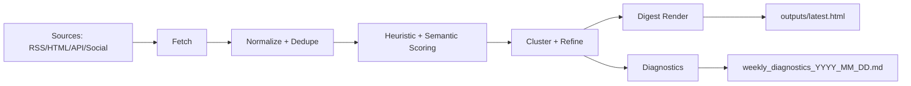

# Agentic AI Digest — Turning AI News into Structured Insight

Keeping up with AI means navigating many fragmented sources: company blogs, research platforms, and media outlets.

This project demonstrates how to build an **agentic AI pipeline** that consolidates, filters, and prioritizes that information into a clear, searchable digest.


## What It Does

- 📥 Collects updates from curated, reliable sources  
- 🧹 Cleans, normalizes, and deduplicates content  
- 🧠 Scores articles (relevance, importance, novelty) using LLMs  
- 🔗 Clusters related items using embeddings  
- ✍️ Generates concise summaries  
- 📊 Produces a ranked, filterable digest  

👉 Focus: **helping decide what deserves attention**

Sources are configured in [`config/source_registry.json`](config/source_registry.json).


## Example Output

Digest Example: [outputs/latest.html](outputs/latest.html)


## About This Project

This is a practical showcase of:

- agentic AI workflows  
- combining deterministic pipelines with LLM-based reasoning  
- building inspectable, production-style systems  
- optimizing for cost using open models  


## Pipeline at a Glance



## Start Here

| Goal | Read |
| --- | --- |
| Understand the project quickly | [Project Overview](docs/project-overview.md) |
| Install and run on Windows/macOS (pip + uv) | [Getting Started](docs/getting-started.md) |
| Understand modules and data flow | [Architecture](docs/architecture.md) |
| Learn what each stage does | [Pipeline Stages](docs/pipeline-stages.md) |
| Review hard-coded thresholds and tuning | [Configuration and Thresholds](docs/configuration-and-thresholds.md) |
| Understand output files and diagnostics | [Outputs and Diagnostics](docs/outputs-and-diagnostics.md) |
| Contribute with local quality checks | [Developer Workflow](docs/developer-workflow.md) |

## Quick Run

```bash
python run_pipeline.py --stage all
```

Outputs are written to [`outputs/`](outputs/).

## Docker

```bash
docker build -t weekly-ai-digest .
docker run --rm --env-file .env -v ${PWD}/outputs:/app/outputs weekly-ai-digest
```

## Quality Gates

```bash
python -m black . --check
python -m ruff check .
python -m mypy
python -m pytest -q
```

CI is configured in [`.github/workflows/ci.yml`](.github/workflows/ci.yml).
