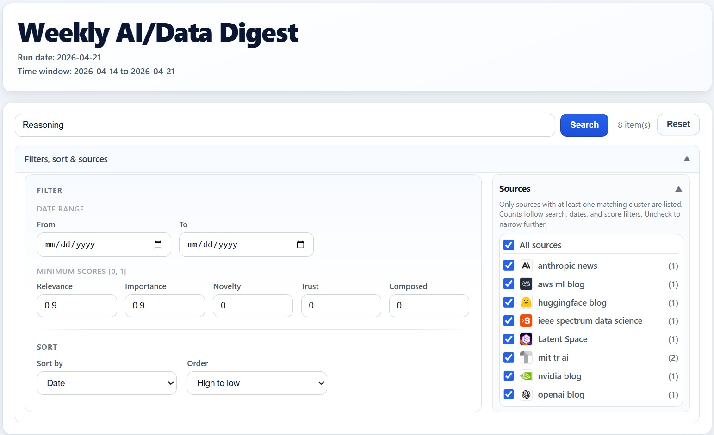
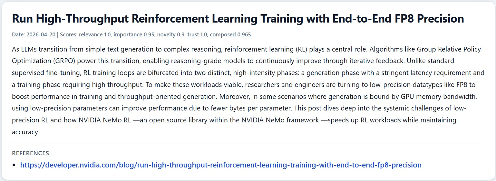
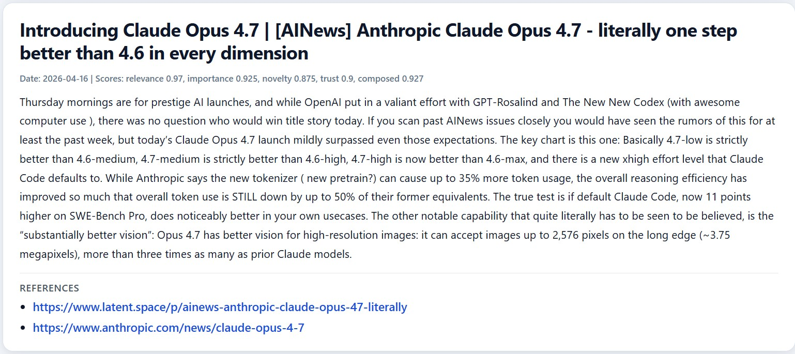
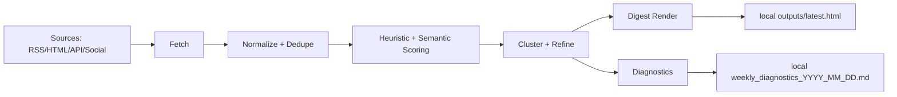

# Agentic AI Digest — From Fragmented AI News to Structured Insight

Keeping up with AI means navigating many fragmented sources: company blogs, research platforms, and media outlets.

This project demonstrates how to build an **agentic AI pipeline** that consolidates, filters, and prioritizes fragmented information into a structured, searchable digest—reducing the effort of scanning multiple sources into a single view.

👉 The goal: **help decide what deserves attention**

## TL;DR

- Aggregates AI updates from multiple trusted sources into one ranked, searchable digest.
- Combines deterministic preprocessing with LLM scoring/summarization and clustering.
- Produces inspectable local artifacts (digest + diagnostics) for transparent debugging.


## 🚀 Live Demo

👉 https://aylin-jarrahnezhad.github.io/agentic-ai-curator/

Explore the full interactive digest (search, filtering, sorting, and clustering).

## Example Output

### 🔎 Structured Digest with Search & Filters



*A consolidated view across multiple sources with filtering, sorting, and search*


### 🧠 Ranked and Summarized Insights



*Each item is scored (relevance, importance, novelty), summarized, and linked to original sources*


### 🔗 Multi-Source Clustering



*Related articles from different sources are grouped into coherent topics*


## Outputs and Diagnostics

Running the pipeline generates structured outputs at each stage, including:

- final digest (HTML and Markdown)
- scored and clustered items
- fetch reports and diagnostics

👉 See full details: [Outputs and Diagnostics](docs/outputs-and-diagnostics.md)

These artifacts make the system fully inspectable and support debugging and validation without relying on black-box behavior.


## What It Does

- 📥 Collects updates from curated, reliable sources  
- 🧹 Cleans, normalizes, and deduplicates content  
- 🧠 Scores articles across relevance, importance, and novelty using LLMs 
- 🔗 Clusters related items using embeddings  
- ✍️ Generates concise summaries  
- 📊 Produces a ranked, filterable digest  

Sources are configured in [`config/source_registry.json`](config/source_registry.json).


## Why This Matters

AI information is distributed across many independent and reliable sources.

This system helps:
- reduce time spent scanning multiple websites  
- prioritize high-impact updates  
- navigate information more efficiently  


## About This Project

This is an MVP and practical showcase of:

- designing **agentic AI workflows**  
- combining deterministic pipelines with LLM-based reasoning  
- building inspectable, production-style systems  
- optimizing GenAI systems for cost using open models  

The focus is on demonstrating **system design, trade-offs, and practical implementation**.

## Notes on Evaluation

This project does not include a formal LLM evaluation pipeline, by design.

The focus of this MVP is on **end-to-end system design and practical usability**, rather than model benchmarking.

Two considerations guided this decision:

- **Summarization task**  
  LLMs are generally reliable for summarization when grounded in source text and paired with references.
  In this system, summaries are tied to original articles and always include references, reducing the risk of misleading outputs.

- **Scoring task (relevance, importance, novelty)**  
  These dimensions are inherently subjective and would require a labeled dataset to evaluate rigorously.  
  In the absence of such data, LLM-based scoring was used as a practical proxy, with outputs validated through manual inspection.

Overall, the system prioritizes:
- deterministic preprocessing for consistency  
- LLM usage where semantic judgment is required  

In a production setting, this could be extended with:
- labeled evaluation datasets  
- quantitative scoring benchmarks  
- human-in-the-loop validation workflows  

## Guardrails and Robustness

The system includes lightweight guardrails to improve reliability:

- strict task schemas for LLM outputs (e.g., structured JSON for scoring and clustering)
- explicit constraints in prompts (e.g., conservative clustering rules)
- retry mechanisms for LLM calls (including backoff/cooldown behavior)
- observable intermediate artifacts and diagnostics for inspection
- deterministic fallback paths when LLM stages fail (for scoring, clustering refinement, summarization, and digest composition)


At this stage, the system does not include some more advanced resilience patterns, such as:

- model fallback (switching between providers/models on failure)
- automatic JSON repair loops (it uses lenient parsing/extraction, but not iterative repair/re-prompt cycles)

These are intentional MVP trade-offs, prioritizing simplicity, inspectability, and predictable behavior over full production-grade robustness.


## Pipeline at a Glance

Fetch → Normalize → Deduplicate → Score → Cluster → Summarize → Render



## Start Here

| Goal | Read |
| --- | --- |
| Understand the project quickly | [Project Overview](docs/project-overview.md) |
| Install and run on Windows/macOS (pip + uv) | [Getting Started](docs/getting-started.md) |
| Understand modules and data flow | [Architecture](docs/architecture.md) |
| Learn what each stage does | [Pipeline Stages](docs/pipeline-stages.md) |
| Review hard-coded thresholds and tuning | [Configuration and Thresholds](docs/configuration-and-thresholds.md) |
| Understand output files and diagnostics | [Outputs and Diagnostics](docs/outputs-and-diagnostics.md) |
| Contribute with local quality checks | [Developer Workflow](docs/developer-workflow.md) |

## Quick Run

```bash
python run_pipeline.py --stage all
```

Outputs are written to `outputs/`.
These files are generated locally per run and are gitignored.

## Docker

```bash
docker build -t weekly-ai-digest .
docker run --rm --env-file .env -v ${PWD}/outputs:/app/outputs weekly-ai-digest
```

## Quality Gates

```bash
python -m black . --check
python -m ruff check .
python -m mypy
python -m pytest -q
```

CI is configured in [`.github/workflows/ci.yml`](.github/workflows/ci.yml).
